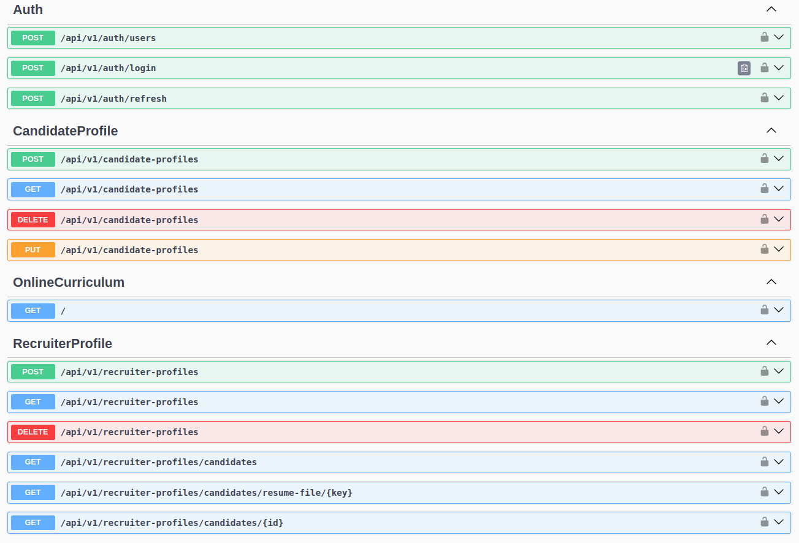

# Online Curriculum API



This project is a backend API developed with **.NET 8** and **SQL Server**, designed to manage curriculum submissions and profile information for **Candidates** and **Recruiters**. It also supports file uploads (CVs) to **AWS S3** and uses **JWT + Refresh Tokens** for authentication.

> Currently, the system supports Candidate and Recruiter profiles. An Admin role is reserved for future features but has no functionality yet.

---

## 🌐 Technologies Used

- [.NET 8](https://dotnet.microsoft.com/en-us/download)
- SQL Server (via AWS RDS)
- AWS EC2 (Linux - Ubuntu 24.04) for hosting
- AWS S3 for storing resumes (currículos)
- JWT & Refresh Token Authentication
- Docker support (`Dockerfile` included)
- In-memory caching
- NGINX for reverse proxy

---

## 📁 Environment Configuration

Before running, create a `.env` file based on `.env-example`:

```env
ConnectionStrings__SqlServer=your-sql-connection
JwtOptions__Issuer=your-issuer
JwtOptions__Audience=your-audience
JwtOptions__SecurityKey=your-secret-key
JwtOptions__Expiration=3600

S3Settings__RegionName=us-east-2
S3Settings__BucketName=your-s3-bucket-name
S3Settings__AccessKey=your-access-key
S3Settings__SecretKey=your-secret-key
````

---

## 🚀 How to Run (Development)

### Using .NET CLI

```bash
dotnet restore
dotnet ef database update
dotnet run
```

### Using Docker

```bash
docker build -t onlinecurriculum .
docker run -d -p 5000:5000 --env-file .env onlinecurriculum
```

---

## ☁️ Deployment Overview

The project was successfully deployed to AWS using:

* **EC2** (Ubuntu 24.04) to host the API
* **RDS (SQL Server)** to persist data
* **S3** to store uploaded CV files

---

## 🌐 Publishing with NGINX (on EC2)

1. **Move your app to `/var/www/onlinecurriculum`**

```bash
sudo mkdir -p /var/www/onlinecurriculum
sudo cp -r ./publish/* /var/www/onlinecurriculum/
```

2. **Create the systemd service**

```ini
# /etc/systemd/system/onlinecurriculum.service
[Unit]
Description=Online Curriculum API
After=network.target

[Service]
WorkingDirectory=/var/www/onlinecurriculum
ExecStart=/usr/bin/dotnet /var/www/onlinecurriculum/OnlineCurriculum.dll --urls=http://0.0.0.0:5000
Restart=always
RestartSec=5
User=www-data
Environment=ASPNETCORE_ENVIRONMENT=Production

[Install]
WantedBy=multi-user.target
```

Then run:

```bash
sudo systemctl daemon-reexec
sudo systemctl daemon-reload
sudo systemctl start onlinecurriculum
sudo systemctl enable onlinecurriculum
```

3. **Install and configure NGINX**

```bash
sudo apt update
sudo apt install nginx -y
```

Create a new config file:

```bash
sudo nano /etc/nginx/sites-available/onlinecurriculum
```

Paste:

```nginx
server {
    listen 80;
    server_name _;

    location / {
        proxy_pass         http://localhost:5000;
        proxy_http_version 1.1;
        proxy_set_header   Upgrade $http_upgrade;
        proxy_set_header   Connection keep-alive;
        proxy_set_header   Host $host;
        proxy_cache_bypass $http_upgrade;
    }
}
```

Then link and reload:

```bash
sudo ln -s /etc/nginx/sites-available/onlinecurriculum /etc/nginx/sites-enabled/
sudo nginx -t
sudo systemctl restart nginx
```

---

## 🔐 Authentication

* Login returns **JWT access tokens** and **refresh tokens**
* Secure routes require `[Authorize]` attributes
* Profiles are identified by role (`Candidate`, `Recruiter`, `Admin`)

---

## 📂 Project Structure

* `/Models`: Entities (Candidate, Recruiter, User, ResumeFile)
* `/Services`: Business logic and S3 handling
* `/Controllers`: API endpoints
* `/Extensions`: Dependency injection and configuration

---

## 🧩 Roles

| Role      | Description                        |
| --------- | ---------------------------------- |
| Candidate | Can manage own profile & upload CV |
| Recruiter | Can view candidate profiles        |
| Admin     | Reserved for future features       |

---

## 📦 Future Improvements

* Admin panel
* Resume parsing with AI
* Job matching algorithms
* Email notifications
* WebSocket support for real-time updates

---

## 📊 Logging & Monitoring

The API uses [**Serilog**](https://serilog.net/) as the logging framework for structured logs, configured to write to:

- **Console**: for development/debugging
- **File**: stored in the `Logs/` folder with daily rolling files
- **Seq**: centralized log storage and analysis

Logs are automatically recorded for unhandled exceptions via a global middleware, which also returns a standard `500 Internal Server Error` JSON response to the client.

To customize logging, check the `serilog.json` file in the root of the project. Example log:

```json
{
  "@t": "2025-05-03T22:00:00Z",
  "@m": "Unhandled exception for request /api/profile",
  "SourceContext": "OnlineCurriculum.Controllers.CandidateProfileController",
  "Level": "Error"
}
````

You can search logs by application, request path, error type, or structured values.

---

## 🐳 Docker Compose for Seq (Log Server)

To run Seq locally with persistent storage and a predefined API key, use the following `docker-compose.yml`:

```yaml
version: '3.8'

services:
  seq:
    image: datalust/seq:latest
    container_name: seq
    ports:
      - "5341:80"
    environment:
      - ACCEPT_EULA=Y
      - SEQ_API_KEY=dev-api-key
    volumes:
      - ./seq-data:/data
    restart: unless-stopped
```

### ▶️ Running Seq

```bash
docker compose up -d
```

Once running, access Seq at:
➡️ `http://localhost:5341`

You can search logs like this:

```
Application = 'OnlineCurriculum'
```

To integrate with the API, ensure `serilog.json` includes the correct `serverUrl` and optional `apiKey`:

```json
{
  "WriteTo": [
    {
      "Name": "Seq",
      "Args": {
        "serverUrl": "http://localhost:5341",
        "apiKey": "dev-api-key"
      }
    }
  ]
}
```

---


## 📄 License

MIT License – © 2025 Paulo Silva